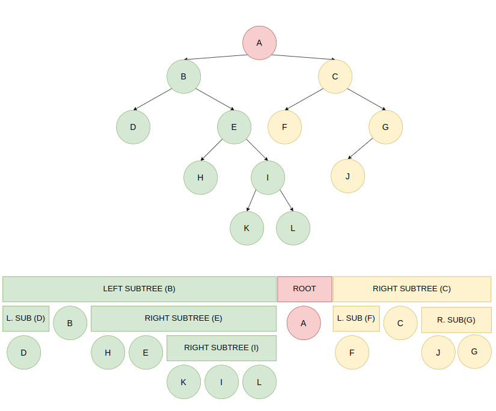

## Enfoque

1. Recorre el subarbol izquierdo.
2. Nombra la raiz.
3. Recorre el subarbol derecho.

## Estrategia

Recursividad

## Complejidad

- `Complejidad temporal: O(n)`
- `Complejidad de espacio: O(n)`
