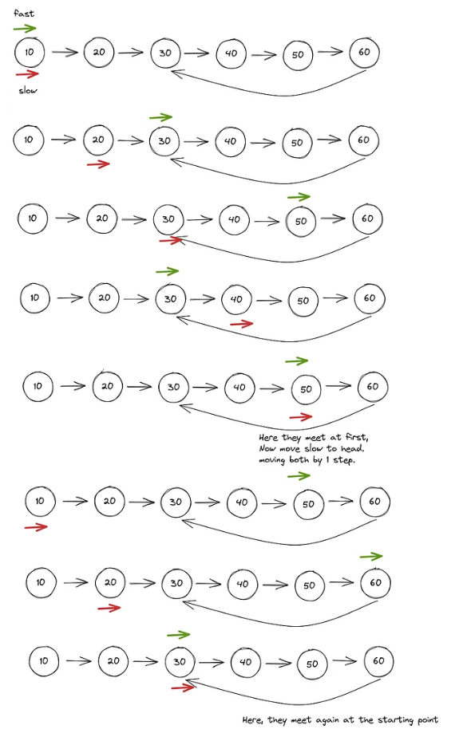

## Approach

1. Create the `slow` and `fast` pointers that points to the head of the LinkedList.
2. While the `fast` pointer and the next node from `fast` are defined, move the `slow` pointer one step forward and the `fast` pointer two steps forward.
3. If during the loop the pointers match, loop one step forward each pointer until the pointers match again, and return one of the pointers.
4. On the other hand, if the loop ends, return `null`.

## Strategy

Fast and Slow pointer in a LinkedList

## Complexity

- `Time complexity: O(n)`
- `Space complexity: O(1)`
