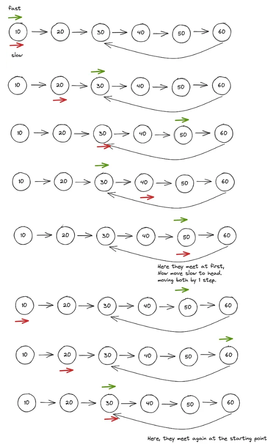

## Enfoque

1. Crear los punteros `fast` y `slow` apuntando al principio de la LinkedList.
2. Mientras el puntero `fast` y su siguiente sean nodos de la lista, mover el puntero `slow` un paso adelante y el puntero `fast` dos pasos adelante.
3. Si durante el loop los punteros son iguales, iterar de a un paso cada puntero hasta que los punteros vuelvan a ser iguales, y retornar uno de los punteros..
4. Si termina el loop, retornar `false`.

## Estrategia

Puntero rapido y lento en LinkedLists

## Complejidad

- `Complejidad temporal: O(n)`
- `Complejidad de espacio: O(1)`
